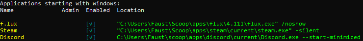

# StartupManager

A tool to manage startup programs on windows through a CLI interface.

- [StartupManager](#startupmanager)
  - [Commands](#commands)
    - [Help](#help)
    - [Version](#version)
    - [List](#list)
    - [Enable](#enable)
    - [Disable](#disable)

## Commands

There are currently three functional commands `List`, `Enable`, `Disable`

### Help

Examples of usage `StartupManager.exe --help` output shown below

Examples of usage `StartupManager.exe list --help` output shown below

### Version

Displays the current version of the application

Examples of usage `StartupManager.exe --version`

### List

Will display a list of applications that starts with windows.

It's possible to use the `--detailed`/`-d` option to get a table output showing more information if they are enabled or not and if modifying them requires administrator rights.

Examples of usage `StartupManager.exe list` or `StartupManager.exe l`

Examples of usage `StartupManager.exe list --detailed` or `StartupManager.exe l -d`

### Enable

Examples of usage `StartupManager.exe enable Steam` or `StartupManager.exe e Steam`

### Disable

Examples of usage `StartupManager.exe disable Steam` or `StartupManager.exe d Steam`

